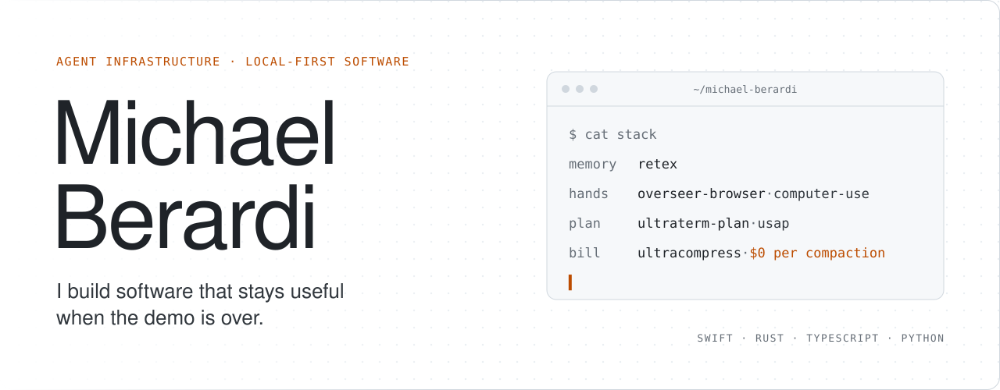

<picture>
  <source media="(max-width: 600px) and (prefers-color-scheme: dark)" srcset="./assets/header-dark-mobile.svg">
  <source media="(max-width: 600px)" srcset="./assets/header-light-mobile.svg">
  <source media="(prefers-color-scheme: dark)" srcset="./assets/header-dark.svg">
  
</picture>

I build the unglamorous parts of AI tooling: the memory, the hands, the plan, and the bill. It runs on your machine, keeps your data in plain files, and is still working in month three, long after the launch thread has scrolled away.

Swift, Rust, TypeScript, and Python, depending on which one the problem prefers.

## Agent infrastructure

| | |
|---|---|
| **[Steak Pi](https://github.com/michael-berardi/steak-pi)** | The [Pi coding agent](https://pi.dev), cooked properly. Native subagents, deterministic compaction, automatic verification, and a TUI worth living in. Eight parallel workers finish in under 1.5 s, at the same peak memory as stock Pi. `TypeScript` |
| **[UltraCompress](https://github.com/michael-berardi/ultracompress)** | Context compaction with no LLM in the loop. About 65 ms where Claude Code's own summarizer takes 23 to 52 seconds, at $0 per compaction, and anything it condenses stays searchable. Ships for Pi and as a Claude Code plugin. `Rust` |
| **[UltraTerm Plan](https://github.com/michael-berardi/ultraterm-plan)** | The plan the agent keeps and you can read. Phases in order, one active task, blocked means blocked. Survives compaction, resume, and a change of agent. `TypeScript` |
| **[USAP](https://github.com/michael-berardi/ultraterm-subagent-protocol)** | A delegation protocol for subagents. Parallelize only what is actually independent, send each task to the cheapest model that can finish it, and treat "done" as evidence to check. `Protocol` |
| **[UTP](https://github.com/michael-berardi/ultraterm-protocol)** | Lets local agents inspect and drive persistent terminal sessions. JSON Lines over a `0600` Unix socket, and every destructive action dry-runs first. `Python` |

## Memory and hands

| | |
|---|---|
| **[Retex](https://github.com/michael-berardi/retex)** | A Markdown vault engine and machine-readable CLI for people and agents. Search, recall, backlinks, boards, undo, and MCP over an ordinary folder. No database to get locked into. `Swift` |
| **[OverSeer Browser](https://github.com/michael-berardi/overseer-browser)** | Model-agnostic browser automation for Chromium. Agents get their own window; your tabs stay yours until you lend one. `TypeScript` `Python` |
| **[UltraTerm Computer Use](https://github.com/michael-berardi/ultraterm-computer-use)** | Desktop automation for any MCP-capable agent on macOS, Linux, and Windows. Screenshots and keystrokes never leave the machine. `Swift` |
| **[Rusty Mirror](https://github.com/michael-berardi/rusty-mirror)** | A hidden, disposable twin of your real Tauri app window, so agents can poke, screenshot and hot-swap the actual app instead of a browser stand-in. `Rust` |

## Apps

| | |
|---|---|
| **[UltraVox](https://github.com/michael-berardi/ultravox)** | Private, on-device transcription for macOS, Windows, and Linux. Dictate into any app, transcribe meetings and media, keep every recording local. [Download](https://github.com/michael-berardi/ultravox/releases/latest) `Rust` |
| **[Skribi](https://github.com/michael-berardi/skribi)** | A calm reader and editor for Markdown libraries and Retex vaults. Imports Obsidian and Notion without holding your notes hostage. `Rust` |
| **[OpenTao](https://github.com/michael-berardi/opentao)** | All 81 chapters of the *Daodejing*, phrase-aligned across Chinese and three English readings. [Read it](https://opentao.pages.dev/) `TypeScript` |

## Small, sharp tools

**[ultra-media-remote](https://github.com/michael-berardi/ultra-media-remote)** reads and controls macOS Now Playing from safe Rust, without linking Apple's private framework. 
**[overseer-best-free](https://github.com/michael-berardi/overseer-best-free)** finds the best free chat model on OpenRouter right now, so your bot stops breaking every Thursday.

## How I work

Private data stays close to the person who owns it. Permissions and failure modes are designed up front, where they belong. Every dependency has to earn its keep. Claims ship with benchmarks, and the benchmarks ship with their caveats.

## Say hello

Issues and pull requests are welcome on any repo above. For product engineering and consulting, find me at [Liberty Design Studio](https://libertydesign.studio/). Independent software lives at [Implose Cybernetics](https://implosecybernetics.com/software/).
