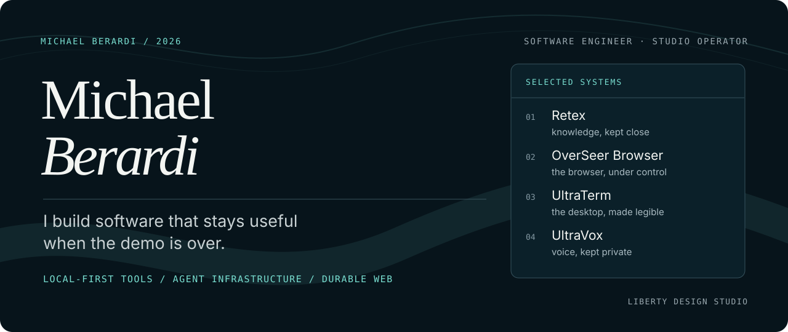

<picture>
  <source media="(max-width: 600px)" srcset="./assets/profile-hero-mobile.svg">
  
</picture>

  <a href="#flagship-projects">Flagship projects</a> ·
  <a href="#protocols">UTP + USAP</a> ·
  <a href="#more-open-source-work">Open-source portfolio</a> ·
  <a href="#engineering-approach">Engineering approach</a>

## What I build

I'm a software engineer who likes the edges where applications meet the operating system: local processes, browsers, desktop interfaces, knowledge stores, media pipelines, and the protocols that let agents use them safely.

Most of my public work is local-first and cross-platform. I work in Swift, Rust, TypeScript, and Python because the problem decides the tool. The common goal is software that people can inspect, operate, and keep under their control.

## Flagship projects

### 01 / [Retex](https://github.com/michael-berardi/retex)

A local-first Markdown knowledge engine and machine-readable CLI for people and agents. Plain files remain the source of truth; exact search, structured queries, bounded recall, MCP access, encrypted exports, and fleet updates sit around them.

`Swift` `Markdown` `MCP` `Local-first` 
[Source and releases →](https://github.com/michael-berardi/retex/releases/latest)

---

### 02 / [OverSeer Browser](https://github.com/michael-berardi/overseer-browser)

Model-agnostic browser automation for Chromium. It uses explicit browser ownership, a local native host, per-user IPC, and one stable interface for navigation, extraction, screenshots, uploads, and diagnostics.

`TypeScript` `Chromium` `Browser automation` `Local IPC` 
[Source and documentation →](https://github.com/michael-berardi/overseer-browser#readme)

---

### 03 / [UltraTerm Computer Use](https://github.com/michael-berardi/ultraterm-computer-use)

Local desktop automation for MCP-capable agents on macOS, Linux, and Windows. Screenshots, accessibility trees, and input actions stay on the machine.

`Swift` `MCP` `Desktop automation` `Cross-platform` 
[Source →](https://github.com/michael-berardi/ultraterm-computer-use) · [Project page →](https://implosecybernetics.com/projects/ultraterm-computer-use/)

---

### 04 / [UltraVox Light](https://github.com/michael-berardi/ultravox-light)

Private, on-device transcription for macOS, Linux, and Windows. Recordings, transcripts, and downloaded models stay with the person using it.

`Rust` `On-device AI` `Transcription` `Cross-platform` 
[Source and releases →](https://github.com/michael-berardi/ultravox-light/releases/latest) · [Project page →](https://implosecybernetics.com/projects/ultravox/)

## Protocols

### [UltraTerm Terminal Protocol (UTP)](https://github.com/michael-berardi/ultraterm-protocol)

A same-user local protocol for inspecting and controlling persistent terminal slots, handing work between profiles, coordinating managers with workers, and reporting through authorized private routes. UTP v2 uses JSON Lines over a mode-`0600` Unix socket; destructive operations use identity-bound dry runs and explicit confirmation.

`Python` `JSON Lines` `Unix sockets` `Agent orchestration` 
[Source →](https://github.com/michael-berardi/ultraterm-protocol) · [Protocol v2 →](https://github.com/michael-berardi/ultraterm-protocol/blob/main/protocols/v2.md)

### [UltraTerm Subagent Protocol (USAP)](https://github.com/michael-berardi/ultraterm-subagent-protocol)

A compact, vendor-neutral protocol for getting more correct work done with subagents. The primary agent keeps decomposition, judgment, integration, and proof; only bounded independent leaves are delegated, concurrency follows the dependency graph, and each leaf routes to the cheapest capable model tier.

`Subagents` `Vendor-neutral` `Model routing` `Integration discipline` 
[Source and protocol →](https://github.com/michael-berardi/ultraterm-subagent-protocol)

## More open-source work

- **[Ultra Media Remote](https://github.com/michael-berardi/ultra-media-remote)** — a shared macOS Now Playing bridge for metadata, artwork, and media transport.
- **[OverSeer Best Free](https://github.com/michael-berardi/overseer-best-free)** — a zero-dependency resolver for the best available free chat model on OpenRouter.
- **[OpenTao](https://github.com/michael-berardi/opentao)** — a phrase-aligned reader for all 81 chapters of the *Daodejing*, with Chinese text, multiple English views, and commentary. [Read it live →](https://opentao.pages.dev/)

## Engineering approach

- **Keep ownership local.** Private data and high-trust actions should stay close to the person operating the software.
- **Make boundaries explicit.** Permissions, transport, authentication, and failure modes belong in the design, not in a footnote.
- **Keep the dependency graph honest.** A dependency should earn the operational weight it adds.
- **Design for the second month.** Installation, diagnostics, upgrades, rollback, and documentation matter after the first demo.
- **Test the contract.** Observable behavior and failure cases matter more than implementation trivia.

## Current interests

Local-first AI infrastructure, MCP and machine-readable CLIs, browser and desktop automation, cross-platform applications, search and knowledge systems, privacy-conscious developer tools, and the boundary between useful automation and user control.

## Where to start

If you're evaluating my engineering work, these projects show different parts of it:

- **Retex** for CLI and data-contract design, indexing, security, and release discipline.
- **OverSeer Browser** for browser architecture, permission boundaries, native messaging, and automation ergonomics.
- **UltraTerm Computer Use** for cross-platform systems work and agent-to-desktop interfaces.
- **UltraVox Light** for Rust, native applications, media pipelines, and private on-device AI.
- **UTP and USAP** for local protocol design, safe multi-agent orchestration, delegation economics, and explicit human authorization.

Thoughtful issues, pull requests, and technical conversations are welcome in the relevant repository. For product engineering or consulting, I work through [Liberty Design Studio](https://libertydesign.studio/). Independent software lives under [Implose Cybernetics](https://implosecybernetics.com/).
